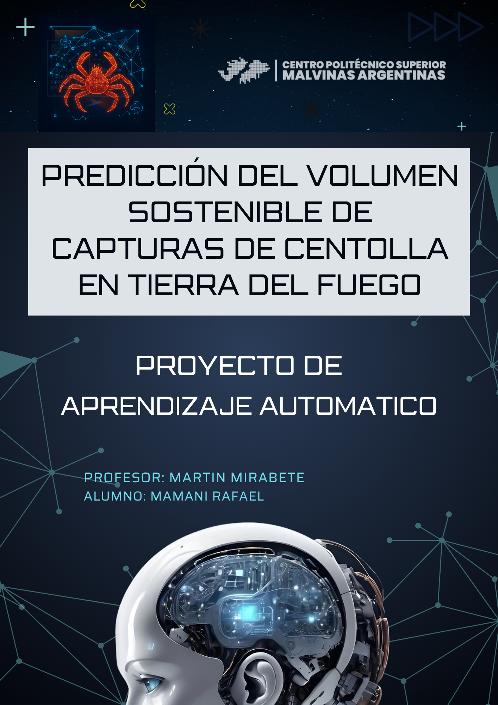
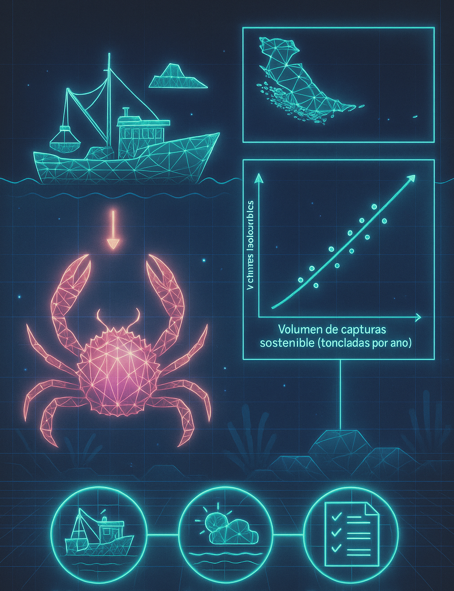
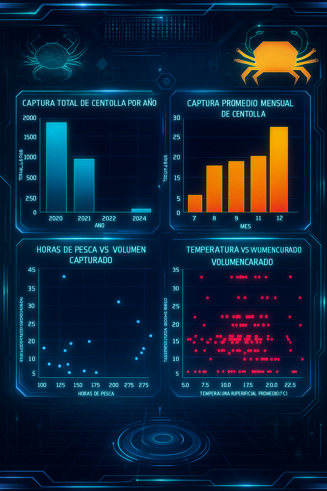
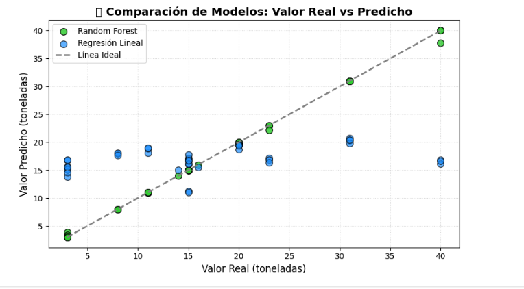

<!-- Portada -->
<p align="center">
  <p align="center">
    
  </p>
</p>

---

**Carrera:** Tecnicatura Superior en Ciencia de Datos e Inteligencia Artificial  
**Institución:** Politécnico Malvinas Argentinas  
**Materia:** Aprendizaje Automático

**Proyecto:** Predicción del volumen sostenible de captura de Centolla en Tierra del Fuego

- **Alumno:** MAMANI, Rafael
- **Profesor:** Martín Mirabete
---

[🎬 Ver video explicativo del proyecto](videos/VideoPrediccionCapturaCentollaTDF.mp4)

---
##  Indice
### Accesos rápidos:
- [1.- Resumen](#1-resumen)
- [2.- Objetivo General](#2-objetivo-general)
- [3.- Objetivos Específicos](#3-objetivos-específicos)
- [4.- Contexto y Relevancia](#4-contexto-y-relevancia)
- [5.- Origen y Descripción de los Datos](#5-origen-del-dataset)
- [6.- Análisis exploratorio de datos](#6-análisis-exploratori-de-datoso)
- [7.- Modelo de Aprendizaje Automático](#7-modelo-de-aprendizaje-automático)
- [8.- Evaluación del modelo](#8-evaluación-del-modelo)
- [9.- Interpretación y conclusiones finales](#9-interpretacion-y-conclusiones-finales)
- [10.- Entregables en el repositorio](#10-entregables-en-el-repositorio)

---
# Descripción del Proyecto
##  1. Resumen

Este proyecto de aprendizaje automático busca predecir el volumen sostenible de capturas de centolla (Lithodes
santolla) por año en Tierra del Fuego, utilizando un modelo de regresión implementado en Python con scikitlearn. El dataset principal, “Pesca y Puertos Pesqueros” del Ministerio de Economía, contiene datos históricos
que permiten identificar patrones para la predicción. El proyecto utiliza la plantilla Cookiecutter Data Science y
un repositorio Git para garantizar reproducibilidad, con resultados documentados. El
modelo no realiza un análisis estadístico, sino que aprende patrones de los datos para generar predicciones
útiles para simulaciones y toma de decisiones en la gestión pesquera.

[🔝 Volver al Índice](#indice)

---

##  2. Objetivo General
Desarrollar un modelo de regresión que prediga el volumen sostenible de capturas de centolla (en toneladas)
por año en Tierra del Fuego, basado en variables como esfuerzo pesquero, condiciones ambientales y
regulaciones, para apoyar la gestión pesquera sostenible.


[🔝 Volver al Índice](#indice)

---

##  3. Objetivos Específicos
1. Preprocesar el dataset para filtrar datos de Tierra del Fuego y centolla, asegurando patrones claros para
el aprendizaje del modelo.
2. Implementar un modelo de regresión (Random Forest Regressor o Linear Regression) para predecir el
volumen sostenible.
3. Modelo con métricas como MSE, MAE y R², validando su capacidad para aprender patrones predictivos.
4. Generar simulaciones de volúmenes sostenibles para recomendar cuotas de pesca optimizadas.
[🔝 Volver al Índice](#indice)

---

##  4. Contexto y Relevancia
Tierra del Fuego,depende de la pesca de centolla como pilar económico en puertos como Ushuaia y Río Grande.
La sobreexplotación y el cambio climático amenazan este recurso, mientras que el aislamiento geográfico
complica la logística. La certificación MSC de la pesquería de centolla resalta la importancia de la sostenibilidad
por lo que predecir volúmenes sostenibles es relevante para: (1) proteger la biodiversidad marina, (2) sostener
la economía local, (3) informar cuotas de pesca, y (4) adaptarse a cambios ambientales. La originalidad radica
en aplicar regresión a datos específicos de centolla en una región remota, generando simulaciones prácticas.
[🔝 Volver al Índice](#indice)

---

##  Origen y Descripción de los datos

### 5. Origen del Dataset

*   **Instituto Nacional de Estadísticas (INE) Chile**, Global Fishing Watch, y fuentes oficiales de regulación pesquera.
*   **Fecha de Adquisición:** Junio de 2025.
*   **Recopilación:** Datos recolectados y consolidados a partir de informes oficiales de desembarques, registros satelitales de esfuerzo pesquero, datos oceanográficos y normativas vigentes.
*   **Política de Datos:** Información pública y gratuita, sujeta a procesos de validación y depuración para garantizar calidad y consistencia.

### Descripción del Dataset

*   **Cantidad de Instancias:** Datos mensuales correspondientes a capturas, esfuerzo pesquero, temperatura superficial y regulación de veda.
*   **Período Cubierto:** Desde enero de 2019 hasta diciembre de 2024, totalizando 72 meses.
*   **Frecuencia:** Datos agrupados a nivel mensual por puerto (principalmente Punta Arenas).
*   **Total de Registros:** Aproximadamente 784 instancias, integrando múltiples variables para análisis y modelado.

### Características (Columnas) y Tipos de Datos

*   **Año:** Año de registro (tipo: entero).
*   **Mes:** Mes de registro (tipo: entero o texto abreviado).
*   **Especie:** Nombre común o científico de la especie (tipo: texto).
*   **Volumen de Captura (toneladas):** Cantidad de centolla desembarcada (tipo: float).
*   **Esfuerzo Pesquero (horas):** Horas de pesca reportadas en la zona (tipo: float).
*   **Número de Embarcaciones:** Cantidad de embarcaciones activas en la pesca (tipo: entero).
*   **Tipo de Arte:** Método o equipo de pesca utilizado (tipo: texto).
*   **Temperatura Superficial del Mar (°C):** Temperatura promedio mensual registrada en la zona de pesca (tipo: float).
*   **Estado de Veda:** Indicador binario o categórico que señala si hay veda vigente en el mes (tipo: booleano o texto).
*   **Variables adicionales:** Variables calculadas o derivadas para el análisis (tipo: varios).

### Información Relevante Adicional

*   **Datos Preliminares:** Los datos se encuentran sujetos a posibles actualizaciones y correcciones posteriores a procesos de limpieza y validación.
*   **Valores Faltantes:** Existen registros con datos ausentes o nulos en algunas variables, particularmente en el esfuerzo pesquero y temperatura, que fueron tratados durante la limpieza.
*   **Consistencia:** Se aplicaron procesos de depuración para homogeneizar nombres de especies, formatos de fecha y codificación de variables categóricas.
[🔝 Volver al Índice](#indice)

---

## 6. Análisis exploratori de datoso

Se realizaron análisis gráficos y estadísticos, incluyendo:

- Captura total anual y promedio mensual de centolla.  
- Relación entre esfuerzo pesquero, temperatura y volumen capturado.  
- Impacto de la veda en los volúmenes de pesca.



---

## Conclusiones del análisis exploratorio
**FACTORES POSITIVOS:**
- Modificaciones en marco regulatorio pesquero
- Extensión de períodos de veda biológica
- Fluctuaciones naturales en biomasa poblacional

**FACTORES DE RIESGO:**
- Inconsistencias en sistema de registro de datos
---
### PATRÓN DETECTADO: Estacionalidad pronunciada

```sql
-- Consulta de distribución estacional
SELECT mes, PROMEDIO(volumen_captura) 
FROM datos_pesca 
WHERE mes IN ('Octubre', 'Noviembre', 'Diciembre')
ORDER BY volumen_captura DESC;

-- RESULTADO: Noviembre > Diciembre > Octubre
```

### INSIGHT CLAVE: Concentración en Q4

| MES | VOLUMEN RELATIVO | SIGNIFICANCIA |
|-----|------------------|---------------|
| **Noviembre** | 100% | **PICO ABSOLUTO** |
| **Diciembre** | 85% | **ALTA** |
| **Octubre** | 70% | **MODERADA** |

**CORRELACIÓN IDENTIFICADA:** Sincronización perfecta con ventanas regulatorias post-veda

---
### MODELO: Análisis de Relación Esfuerzo-Rendimiento

```r
# Análisis de correlación avanzado
coeficiente_correlacion <- cor(horas_pesca, volumen_captura)
modelo_regresion <- lm(volumen ~ esfuerzo + factores_ambientales)

# R² moderado con alta dispersión residual detectada
```

### HALLAZGOS ESTADÍSTICOS

**CORRELACIÓN POSITIVA:**
- **Tendencia:** "esfuerzo_mayor → captura_mayor"
- **Intensidad:** "moderada"

**ALTA VARIANZA:**
- **Dispersión:** "significativa"
- **Outliers:** "detectados"

**CASOS ATÍPICOS:**
- Alto esfuerzo / Baja captura: "identificados"
- Bajo esfuerzo / Alta captura: "documentados"

### FACTORES DE VARIABILIDAD IDENTIFICADOS

- Esfuerzo Pesquero
- Abundancia Espacial
- Condiciones Oceanográficas
- Eficiencia de Flota
- Factores Estocásticos

---

ANÁLISIS MULTIVARIADO: TEMPERATURA vs CAPTURA

### RESULTADO: Relación estadísticamente no significativa
| TIPO | DESCRIPCIÓN | PROBABILIDAD |
|------|-------------|--------------|
| **DIRECTA** | Temperatura como predictor primario | **BAJA** |
| **INDIRECTA** | Efectos mediados por variables latentes | **ALTA** |
| **TEMPORAL** | Efectos con lag temporal no capturados | **MEDIA** |

---
### RANKING DE IMPORTANCIA DE VARIABLES

| VARIABLE | PODER PREDICTIVO | SIGNIFICANCIA | IMPACTO | PRIORIDAD |
|:---------|:----------------:|:-------------:|:-------:|:---------:|
| **Estacionalidad Temporal** | **ALTO** | `p < 0.001` | **CRÍTICO** | **#1** |
| **Variabilidad Interanual** | **ALTO** | `p < 0.01` | **ALTO** | **#2** |
| **Esfuerzo Pesquero** | **MEDIO** | `p < 0.05` | **MEDIO** | **#3** |
| **Temperatura Superficial** | **BAJO** | `p > 0.05` | **BAJO** | **#4** |

---
Estos resultados sugieren que la captura de centolla en Punta Arenas tiene una marcada estacionalidad y una fuerte variabilidad interanual. El esfuerzo pesquero tiene cierta relación con el volumen capturado, pero otros factores (regulaciones, clima, dinámica poblacional) probablemente también juegan un papel relevante.
Será útil profundizar en análisis de regresión o modelos predictivos para comprender mejor las relaciones entre las variables y evaluar el impacto de la veda y las regulaciones sobre la sostenibilidad de la pesquería.
[🔝 Volver al Índice](#indice)

---

## 7. Modelo de Aprendizaje Automático

- Algoritmos utilizados: Regresión Lineal y Random Forest Regressor.  
- Variables predictoras: Esfuerzo pesquero, temperatura, indicadores de veda, y datos temporales.  
- Se aplicaron técnicas de limpieza, normalización y validación cruzada para garantizar robustez.
[🔝 Volver al Índice](#indice)

---

## 8. Evaluación del modelo

| Métrica               | Regresión Lineal | Random Forest |
|-----------------------|------------------|---------------|
| MAE (Error absoluto)   | 7.90             | 0.14          |
| MSE (Error cuadrático) | 102.44           | 0.18          |
| R² (Determinación)     | 0.11             | 1.00          |


[🔝 Volver al Índice](#indice)

---

## 9. Interpretación y conclusiones finales

---

## Conclusión final del proyecto

- Se integraron y procesaron datos de captura de centolla, esfuerzo pesquero, temperatura superficial y regulación de veda, siguiendo el estándar profesional de proyectos de ciencia de datos.
- Se probaron modelos de regresión lineal y Random Forest para predecir el volumen mensual de captura.

### Resultados
- La regresión lineal explicó solo una pequeña parte de la variabilidad (R2 ≈ 0.11), pero mostró un comportamiento más estable.
- El Random Forest, en la evaluación tradicional (train/test), mostró un ajuste casi perfecto (R2 ≈ 1), pero la validación cruzada reveló un **sobreajuste extremo** (R2 promedio ≈ -11.8), señalando que no puede generalizar a datos realmente nuevos.
- El análisis de importancia de variables sugiere que ciertas variables tienen más influencia, lo que puede guiar la toma de decisiones y la recolección de futuros datos.

### Recomendaciones 
- **La validación cruzada es fundamental**: sólo confiar en los resultados de un único test puede llevar a conclusiones erróneas.
- **Los modelos complejos requieren más datos y cuidado**: El sobreajuste es un riesgo serio en datasets pequeños.
- Es recomendable:
  - Recolectar más datos (más años, otras zonas, variables biológicas o económicas).
  - Probar técnicas de regularización y modelos más simples como benchmark.
  - Utilizar el análisis de importancia de variables para enfocar la gestión pesquera y futuras investigaciones.


Este proyecto es una base sólida para el análisis de series temporales en recursos pesqueros, pero también muestra los límites de la predicción automática cuando los datos son escasos. La ciencia de datos responsable debe reportar tanto los aciertos como las limitaciones para que la toma de decisiones sea robusta y basada en evidencia.
[🔝 Volver al Índice](#indice)

---

## 10. Entregables en el repositorio

- Notebooks: Exploración, análisis, modelado y depuración.  
- Dataset procesado (`dataset_modelado_final.csv`).  
- Gráficos y reportes generados.  
- Documento descriptivos
- Video Explicativo
[🔝 Volver al Índice](#indice)


---
Project Organization
------------

    ├── LICENSE
    ├── Makefile           <- Makefile with commands like `make data` or `make train`
    ├── README.md          <- The top-level README for developers using this project.
    ├── data
    │   ├── external       <- Data from third party sources.
    │   ├── interim        <- Intermediate data that has been transformed.
    │   ├── processed      <- The final, canonical data sets for modeling.
    │   └── raw            <- The original, immutable data dump.
    │
    ├── docs               <- A default Sphinx project; see sphinx-doc.org for details
    │
    ├── models             <- Trained and serialized models, model predictions, or model summaries
    │
    ├── notebooks          <- Jupyter notebooks. Naming convention is a number (for ordering),
    │                         the creator's initials, and a short `-` delimited description, e.g.
    │                         `1.0-jqp-initial-data-exploration`.
    │
    ├── references         <- Data dictionaries, manuals, and all other explanatory materials.
    │
    ├── reports            <- Generated analysis as HTML, PDF, LaTeX, etc.
    │   └── figures        <- Generated graphics and figures to be used in reporting
    │
    ├── requirements.txt   <- The requirements file for reproducing the analysis environment, e.g.
    │                         generated with `pip freeze > requirements.txt`
    │
    ├── setup.py           <- makes project pip installable (pip install -e .) so src can be imported
    ├── src                <- Source code for use in this project.
    │   ├── __init__.py    <- Makes src a Python module
    │   │
    │   ├── data           <- Scripts to download or generate data
    │   │   └── make_dataset.py
    │   │
    │   ├── features       <- Scripts to turn raw data into features for modeling
    │   │   └── build_features.py
    │   │
    │   ├── models         <- Scripts to train models and then use trained models to make
    │   │   │                 predictions
    │   │   ├── predict_model.py
    │   │   └── train_model.py
    │   │
    │   └── visualization  <- Scripts to create exploratory and results oriented visualizations
    │       └── visualize.py
    │
    └── tox.ini            <- tox file with settings for running tox; see tox.readthedocs.io

[🔝 Volver al Índice](#Volver-al-Indice)
--------